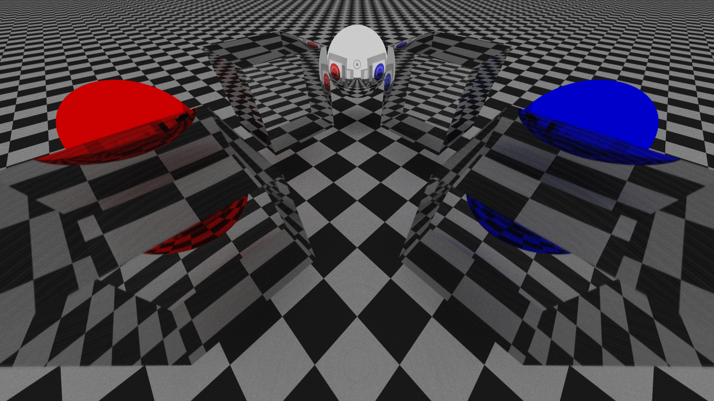
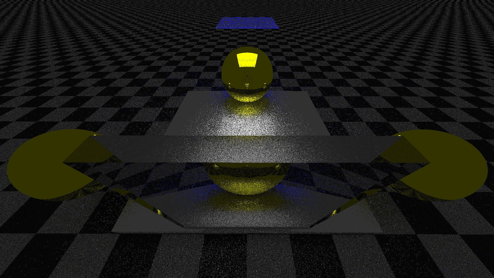
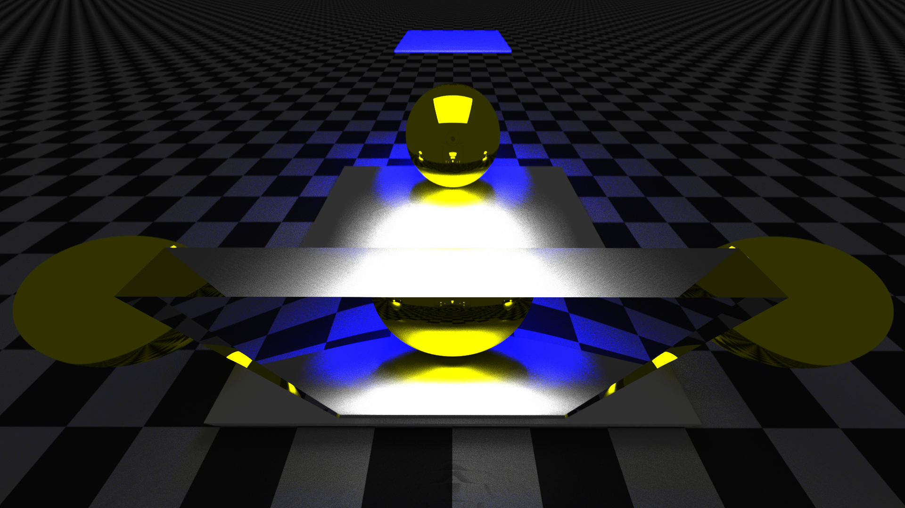

# SimplePathTracer
PathTracerOpenCL is a C++ project that implements a simple openCL pathtracing algorithm using OpenCL compute shader.
The scene defined by a signed distance field and rendered using raymarching. It supports scattered reflection, refraction
and light emission.

## Examples
#### Initial scene

#### Rendered scene


#### Initial scene

#### Rendered scene


## Prerequisites
Before running PathTracerOpenCL, make sure you have the following dependencies installed:

C++ compiler with C++14 support
CMake (version >= 3.22.1)
OpenGL and GLEW

## Installation
Clone the repository:
```bash
git clone git@github.com:Topxic/PathTracerOpenCL.git
cd PathTracerOpenCL
```
Download git submodules:
```bash
git submodule update --init --recursive
```
Install dependencies:
```bash
sudo apt-get update
sudo apt-get install cmake g++ libx11-dev libxrandr-dev libxinerama-dev libgl1-mesa-dev libglew-dev
```
Build cmake project:
```bash
mkdir build
cd build
cmake ..
make
```
Run the program:
```bash
./path-tracer
```
